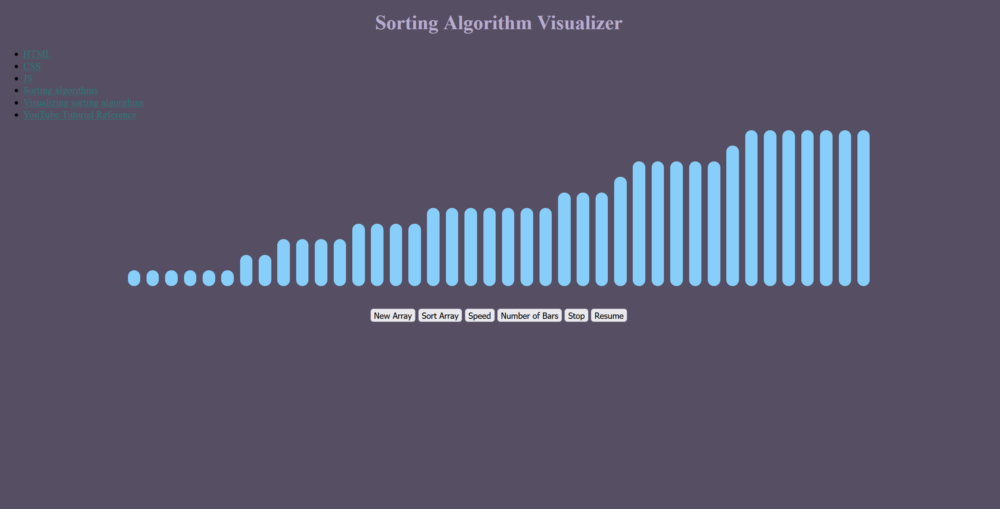

This is a webpage I am making dedicated to visualizing all kinds of algorithms used in computer science

I am making it to help me (re)learn HTML, CSS, JS, data visualization, algorithms, and whatever else that comes to mind that is related.

Starting off with bubble sort algorithm and moving into other sorting algorithms, then I will tackle data structures such as binary search, shortest path, etc.

I will also implement the (big O, theta, omega notations as well either before or in the middle of data structures.)

So far, bubble sort has been implemented, and I've learned a great deal and had a lot of fun getting it to work.

Next is some scaling, some polish, then moving on to more sorting algorithms.

